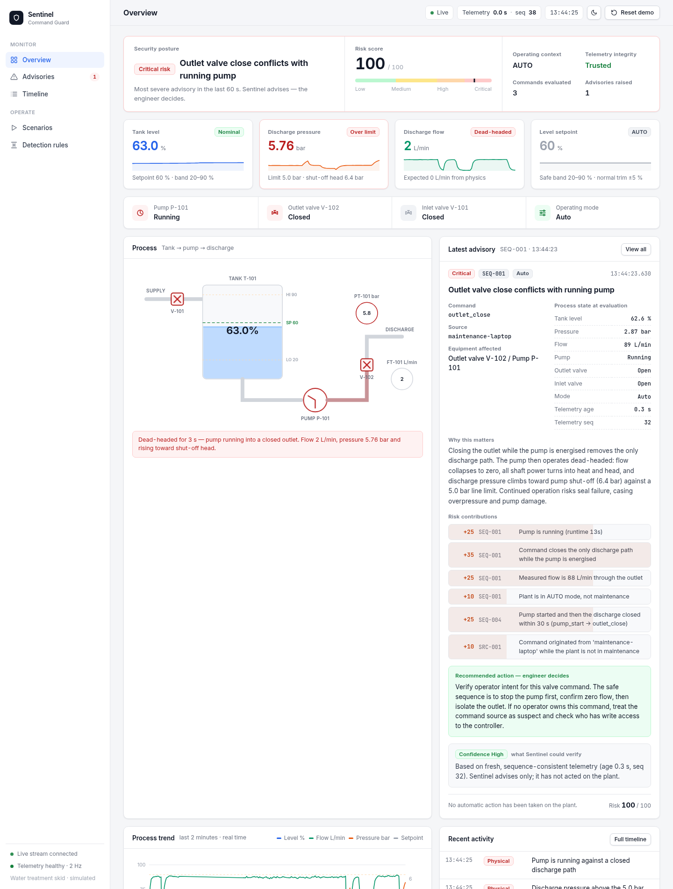

# Sentinel — Critical Infrastructure Command Guard

> **Valid commands. Unsafe consequences. Detected in context.**

Sentinel is a process-aware OT security layer for the ISCS hackathon challenge
**E1 — Catching Unsafe Commands in Your Own Control System**. It watches the
commands and telemetry of a (simulated) water-treatment pump skid and asks, for
every command, not *"is this authorised?"* but **"does this make sense for the
physical process right now?"** — then explains its reasoning to a human
engineer, who keeps the final decision.

The full product requirements document is in [`readme.md`](readme.md). This
file is the run book.



The dashboard has five views — **Overview**, **Advisories**, **Timeline**, **Scenarios**
and **Detection rules** — with light and dark themes (toggle in the top bar, or
`?theme=dark`). All timestamps are wall-clock: the simulator integrates physics over
real elapsed time, so pump runtimes, dead-head durations and the trend axis are real
seconds.

---

## 1. Run it

### Option A — local Python (what the demo machine uses)

Requirements: Python 3.10+, `mosquitto` on the PATH.

```bash
pip install -r requirements.txt      # paho-mqtt, flask, pytest
./run.sh                             # broker + simulator + guard + dashboard
```

Open **http://localhost:8080**. `Ctrl-C` stops everything; logs are in `./logs`.

### Option B — Docker

```bash
docker compose up --build            # same four services, same URL
```

### Option C — by hand (four terminals)

```bash
mosquitto -c mosquitto/mosquitto.conf
python -m sentinel.plant.run          # process simulator, 2 Hz telemetry
python -m sentinel.guard.run          # the command guard
python -m sentinel.api.app            # dashboard on :8080
```

### Tests

```bash
python -m pytest tests -q             # 55 unit/acceptance tests, < 2 s
python -m pytest tests -q             # + 3 MQTT integration tests when a broker is up
```

`tests/test_acceptance.py` maps one-to-one onto the PRD's acceptance criteria
(section 52). `tests/test_integration.py` drives simulator → MQTT → guard →
status and asserts detection latency under one second.

---

## 2. The demo (≈ 4 minutes)

Use the **Scenarios** view in the dashboard, or the CLI:

```bash
python -m sentinel.attacks.run --list
python -m sentinel.attacks.run unsafe_valve
```

| # | Scenario | What the judge sees | Guard verdict |
|---|----------|---------------------|---------------|
| 1 | **Unsafe valve command** (flagship) | Plant pumping normally. One protocol-valid `outlet_close` arrives. Flow collapses, pressure climbs to shut-off head on the mimic. | **CRITICAL · SEQ-001** — "Outlet valve close conflicts with running pump" |
| 2 | Setpoint manipulation | Operator trims +5 % (quiet). Attacker jumps to 95 %. | **HIGH · ROC-001 + ENV-001** |
| 3 | **Slow setpoint drift** | +4 % at a time, 60 → 92 %. No single step looks wrong. | **MEDIUM · ROC-002** while still inside the band (with time-to-limit), **HIGH** once outside |
| 4 | Pump start into closed discharge | Line correctly isolated, then an unexpected `pump_start`. | **HIGH · STATE-002** |
| 5 | Rapid actuator sequence | Five actuator commands in four seconds. | **MEDIUM+ · SEQ-002 / SEQ-003** |
| 6 | **Telemetry & command replay** | Controller telemetry suppressed and a frame replayed; the tank drains behind the frozen picture; a captured command is replayed verbatim. Level jumps when telemetry returns. | **MEDIUM → HIGH · TEL-002** and **HIGH · CMD-001**; advisories marked *Confidence LOW* |
| 7 | **Legitimate maintenance** | `maintenance_on → pump_stop → outlet_close` — the same commands as an attack. | **Quiet.** Context recognised. |
| 8 | Planned shutdown | Pump off → discharge closed → supply closed. | **Quiet.** |
| 9 | Planned start-up | Supply → discharge → pump. | **Quiet.** |
| 10 | Normal operations | Trims and correctly sequenced valve changes. | **Quiet.** |

Suggested narrative (PRD sections 57–60):

1. **Everything is normal.** Point at tank 60 %, pump ON, 89 L/min, 2.8 bar, `SYSTEM STATUS: NORMAL`.
2. **Run scenario 1.** Do not say it is malicious. Watch the posture strip go CRITICAL *before* the pressure moves, then watch the physics confirm it: flow → 0, PT-101 → 6.3 bar, the V-102 symbol turns red, the discharge line throbs, the pressure KPI flips to *Over limit*.
3. **Read the advisory** (Overview → Latest advisory, or the Advisories view). Command, source, the exact state it was judged against, *why* (dead-heading), the point-by-point risk contributions, and what to verify. Note the footer: *Sentinel does not act on the plant.*
4. **Run scenario 6.** Same isolation commands, plant in MAINTENANCE — nothing above LOW. Then use the operator console to send `OUTLET CLOSE` while the pump is *running* in maintenance: MEDIUM, with the mitigation shown explicitly. Context changes the verdict; it doesn't blind the guard.
5. **Run scenario 5.** The KPIs keep showing a comfortable state, but the *Telemetry* pill goes red, the sequence number stops advancing (`seq 41 ×12`), *Telemetry integrity* reads **Untrusted**, and the advisory escalates MEDIUM → HIGH as the replayed frame ages.

**Reset demo** (top bar) returns the simulator, the guard and the timeline to nominal.

---

## 3. Architecture

```
  browser  ◄── SSE ──  sentinel.api.app  (Flask, SQLite history, scenario runner)
                              ▲
              guard/alert · guard/status · guard/assessment
                              │
                      sentinel.guard.run          ← observer only, no write path
                              ▲
                plant/telemetry · plant/command
                              │
                   Mosquitto MQTT broker
                              ▲
                 ┌────────────┴────────────┐
          sentinel.plant.run        sentinel.attacks
          (physics simulator)       (scripted scenarios)
```

| Module | Role |
|--------|------|
| `sentinel/plant/simulator.py` | Pure, deterministic physics: tank, inlet, pump, outlet, pressure, flow. Models dead-heading, cavitation, level limits. Accepts *any* well-formed command — like a real controller. |
| `sentinel/guard/state.py` | The guard's mirror of the plant, telemetry-integrity tracking (sequence, age, restarts vs. replays), command history, digital-twin expected flow. |
| `sentinel/guard/rules.py` | The detection layers. Each rule is a pure function returning weighted, human-readable `Finding`s. |
| `sentinel/guard/risk.py` | Additive risk score, severity bands, and the narrative (summary / why / recommendation) per dominant rule. |
| `sentinel/guard/engine.py` | Orchestration: per-command evaluation, periodic process checks with escalation-aware de-duplication, status. |
| `sentinel/attacks/scenarios.py` | The seven scripted scenarios. |
| `sentinel/api/` | REST + SSE backend and the vanilla HTML/CSS/JS dashboard (no build step). |
| `sentinel/guard/catalogue.py` | Rule catalogue and thresholds served to the *Detection rules* view. |
| `sentinel/config.py` | Every threshold and weight, in one place. |

MQTT topics: `plant/telemetry`, `plant/command`, `plant/event`, `plant/mode`,
`guard/alert`, `guard/assessment`, `guard/status` (retained), plus
`plant/sim` (attack-simulator hook for telemetry blackout) and
`sentinel/control` (demo reset).

REST: `GET /api/state · /api/status · /api/alerts · /api/events · /api/assessments ·
/api/trend · /api/stats · /api/scenarios · /api/rules · /api/export/alerts.csv · /api/stream (SSE)`,
`POST /api/command · /api/scenario/<id> · /api/scenario/stop · /api/reset`.

---

## 4. Detection layers and risk model

`Risk = Σ finding weights`, clamped to 0–100. Bands: **0–29 LOW · 30–59 MEDIUM
· 60–79 HIGH · 80–100 CRITICAL**. Alerts below 15 are logged as assessments
only. Every point is traceable to a named finding in the advisory.

| Rule | Layer | Fires when | Weight(s) |
|------|-------|-----------|-----------|
| **SEQ-001** | State | `outlet_close` while pump running | +25 pump running · +35 closing discharge · +25 flow active · +10 not maintenance · −25 pump stop already commanded |
| STATE-002 | State | `pump_start` with outlet closed | +50 · +10 not maintenance |
| STATE-003 | State | `pump_start` below minimum suction level | +30 / +35 |
| STATE-004 | State | `inlet_close` while pump drawing tank toward low limit | +30 (with projected time-to-limit) |
| ROC-001 | Rate of change | Setpoint step > ±5 % / > 15 % | +15 / +25 |
| **ROC-002** | Rate of change | ≥ 3 small setpoint steps whose net change over 10 min exceeds 15 % | +25 · +15 if the band edge is < 15 min away at this rate |
| ENV-001 | Envelope | Setpoint outside 20–90 % | +20 |
| ENV-002 | Envelope | Load-adding command while pressure already > 4 / > 5 bar | +12 / +25 |
| SEQ-002 | Timing | ≥ 4 actuator commands in 5 s · ≥ 8 in 30 s | +25 · +12 |
| SEQ-003 | Sequence | Same actuator driven both ways inside 5 s | +15 |
| SEQ-004 | Sequence | Known unsafe pattern, e.g. `pump_start → outlet_close` | +25 |
| CMD-001 | Integrity | Command timestamp > 30 s old / in the future, or message id already processed | +30 · +40 |
| TEL-001 | Integrity | Newest telemetry > 3 s old | +25 |
| TEL-002 | Integrity | Sequence number repeated ≥ 3× (replay) | +35 |
| TEL-003 | Integrity | Sequence went backwards with an *old* timestamp | +25 |
| PHY-001 | Physics | Reported flow disagrees with pump/valve state for > 4 s | +25 |
| SRC-001 | Context | Unrecognised source, or maintenance host outside maintenance | +10 |
| **CTX-001** | Context | Plant in MAINTENANCE and command is an isolation/restoration step | **−30** |

Worked example (PRD section 25): pump ON, 88 L/min, AUTO, `outlet_close` from
a maintenance laptop → 25 + 35 + 25 + 10 + 10 = **CRITICAL 100**. The same
command in MAINTENANCE with the pump already stopped → no findings → **quiet**.
With the pump still running in MAINTENANCE → 85 − 30 = **MEDIUM 55**, with the
mitigation printed in the advisory. A fully cancelled command that would have
been ≥ MEDIUM is reported as a LOW `CTX-001` advisory that states what it
*would* have scored — context is visible, not silent.

---

## 5. What Sentinel does when it is unsure

Every advisory carries a **confidence** (HIGH / REDUCED / LOW) and a plain
statement of what could not be verified. When telemetry is stale or replayed,
when instruments disagree with the physics, or when there is no telemetry at
all, Sentinel **still raises the advisory** — integrity findings add to the
score rather than suppress it — marks it LOW/REDUCED confidence, says exactly
why, and asks for the plant to be confirmed by other means. It never blocks:
safety-direction commands (pump stop, valve open, maintenance on) are never
flagged as unsafe on their own, and the guard has no write path to the plant.
The same policy is shown in the dashboard's *Detection rules* view.

## 5. Design decisions worth knowing

- **The guard has no write path to the plant.** It subscribes and publishes
  advisories; `tests/test_acceptance.py::test_guard_never_acts_on_the_plant`
  pins this (PRD FR-011).
- **Deterministic before clever.** Additive weights over an ML model, because a
  judge can follow every number (PRD section 24).
- **Controller restart ≠ replay.** A lower sequence number with a *newer*
  timestamp is a counter restart; only an older timestamp counts as replay.
  Regressions clear after 20 clean frames so the demo is repeatable.
- **Instrument lag is not an anomaly.** The physics-residual rule needs the
  mismatch to persist for 4 s.
- **Escalation re-alerts immediately.** A persisting process condition
  re-alerts every 30 s — unless its severity rises, in which case the engineer
  hears about it at once (replay: MEDIUM → HIGH as the frame goes stale).
- **PRD deviations.** The PRD's worked example labels a score of 95 "HIGH" while
  its own banding table puts 80+ in CRITICAL; the table wins. The flagship rule
  keeps the id `SEQ-001` to match the PRD's alert example even though it is a
  state rule.
