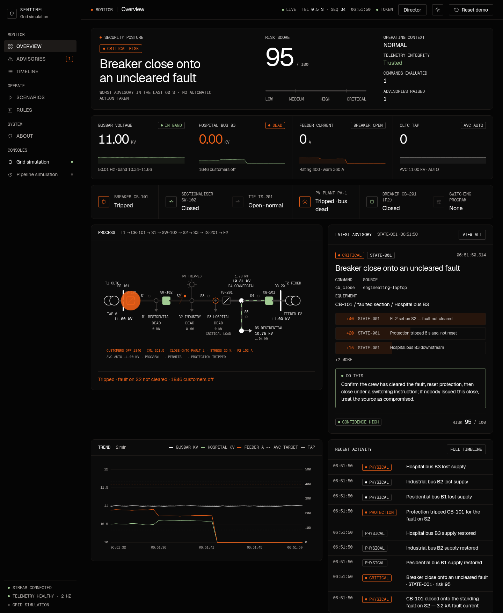

# Sentinel — Command Guard for an 11 kV Distribution Feeder

> **Valid commands. Unsafe consequences. Detected in context.**
> ICSC 2026 · Track E, Critical Infrastructure & Energy · Challenge E1, *Catching Unsafe Commands in Your Own Control System*

[](https://github.com/DanonymousCoder/Sentinel/releases/tag/v1.0.0-icsc)
[](LICENSE)

Sentinel watches every switching command and setpoint sent to a simulated distribution feeder — over **Modbus TCP** (the RTU's native protocol, with a passive wire tap) and MQTT — and asks the question the protocol never does: **does this command make physical sense for the network right now?** A `cb_close` is issued fifty times a week. The one sent while a fault is still on the section drives kilo-amps of fault current into it. Sentinel tells the control engineer *what* was commanded, *which equipment* it touches, *why* it is dangerous, *how sure* it is, and *what to verify* — and never operates the network itself.



```bash
git clone https://github.com/DanonymousCoder/Sentinel.git && cd Sentinel && docker compose up
```
Open **http://localhost:8080**. No Docker? `./run.sh` does the same with local Python 3.10+ and Mosquitto.

## The feeder

One 11 kV radial feeder F1: a 33/11 kV transformer with an on-load tap changer under automatic voltage control, feeder breaker **CB-101**, sectionaliser **SW-102**, normally-open tie **TS-201** to feeder F2, a 2 MWp PV plant, and three load groups — residential B1, industrial B2, and **hospital bus B3**. The physics is a forward-backward sweep power flow: per-section voltage drop, fault current, protection trips, source paralleling, and a tap changer that obediently walks the busbar out of statutory limits if you ask it to.

## Four minutes, four moments

| | What the judge sees | Verdict |
|---|---|---|
| **1** | Normal traffic: an AVC trim, a PV curtailment. | Quiet. |
| **2** | A fault on S2 trips CB-101; the hospital bus goes dark. A valid `cb_close` arrives from an engineering laptop before the crew has cleared it. | **CRITICAL · STATE-001** — fault indicator FI-2 set, protection not reset, hospital downstream. |
| **3** | The crew clears the fault, protection is reset, the operator sends the *same* `cb_close`. | Quiet — context, not the command, decides. |
| **4** | Telemetry is frozen and replayed; SW-102 is opened behind the frozen picture; a captured command is replayed verbatim. | **TEL-002**, **CMD-001**, every advisory at **confidence LOW**. |

`make demo` replays exactly this sequence headless and asserts every verdict; `make demo-live` drives the running console through it. Script and fallback: [docs/DEMO.md](docs/DEMO.md).

## Results

<!-- metrics:start -->
- **133 offline tests pass**; 5 more run end to end over a live broker.
- **11/11 attack scenarios** detected at their required level; **0 false positives** above LOW across 8 legitimate scenarios.
- Flagship close-onto-fault: **CRITICAL · score 95**, raised the moment the command arrives (evaluation p95 **0.84 ms**).
- Full tables: [docs/RESULTS.md](docs/RESULTS.md).
<!-- metrics:end -->

## How it decides

Seven deterministic layers, additive weights, every point traceable to a named finding:

| Layer | Rules | Catches |
|---|---|---|
| State | STATE-001…007 | close onto fault, open under load, uncontrolled parallel, energise under permit, isolate the hospital, tap past the limit, curtail under stress |
| Sequence | SEQ-004 | known multi-step paths into an unsafe configuration |
| Timing | SEQ-002 / SEQ-003 | rapid switching, breaker pumping |
| Rate of change | ROC-001 / ROC-002 | large target steps, slow drift with time-to-limit |
| Envelope | ENV-001 / ENV-002 | statutory voltage band, feeder rating |
| Context | CTX-001…003, SRC-001 | switching programs by named equipment, permits, restoration, signed command sources |
| Integrity | TEL-001…003, CMD-001, PHY-001 | stale or replayed telemetry, replayed commands, physics that disagrees with the instruments |

A learned baseline (BASE-001) adds what this feeder's traffic normally looks like: cadence per source, target ranges, command mix. Score = Σ weights, clamped 0–100; 30 MEDIUM, 60 HIGH, 80 CRITICAL.

**When it is unsure** it says so: stale, replayed or physically inconsistent telemetry never silences an advisory — it is raised at LOW or REDUCED confidence with a statement of what could not be verified. **It never blocks**: the guard has no write path to any switchgear. The human holds the decision. Trust boundary and residual risks: [docs/THREAT-MODEL.md](docs/THREAT-MODEL.md).

## Second process, same engine

The detector core is process-agnostic. A crude oil pipeline pump station — tank farm T-101, mainline pump P-101, sectionalising valve MOV-201, emergency shutdown valve ESD-301, DRA injection — runs on the same engine behind one flag as a portability proof, never as a parallel story:

```bash
./run.sh --profile pipeline        # http://localhost:8081
```

## Repository

```
sentinel/
├── plant/grid.py        feeder physics: power flow, protection, AVC, faults      plant/modbus.py   Modbus TCP RTU + wire tap
├── guard/               engine, grid_rules, risk, baseline, state, dispatcher    guard/run.py      the guard service
├── domains/             grid.py (flagship), pipeline.py (portability proof)
├── attacks/             scenario scripts, Modbus injector                        api/              Flask + SSE console
├── demo.py  evaluate.py  metrics.py                                             harness.py        offline replay rig
tests/                   unit, acceptance (one per PRD criterion), integration over MQTT and Modbus
docs/                    DEMO.md · RESULTS.md · THREAT-MODEL.md · DECISIONS.md · TASKS.md · PRD-v2-distribution-grid.md
```

More: [QUICKSTART.md](QUICKSTART.md) for running, testing, Modbus and the console token; [docs/PRD-v2-distribution-grid.md](docs/PRD-v2-distribution-grid.md) for the full specification.

## License

MIT — see [LICENSE](LICENSE).
